# My ZMK keymap

Default readme from the template: README from template.md

## Basic Alpha and Symbol layout: NEO2
The basis for the layout is the [neo2 layout](https://www.neo-layout.org/)

## Layout overview

**➡️ [Interactive tabbed view](https://krfritsch.github.io/neo2-glove80-zmk-config/)** — one tab per layer, like on neo-layout.org.

Drawn automatically with [keymap-drawer](https://github.com/caksoylar/keymap-drawer) on every keymap change. Click a layer to expand it.

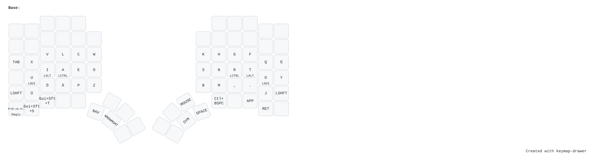

<details><summary>🔣 Symbols (SYM)</summary>

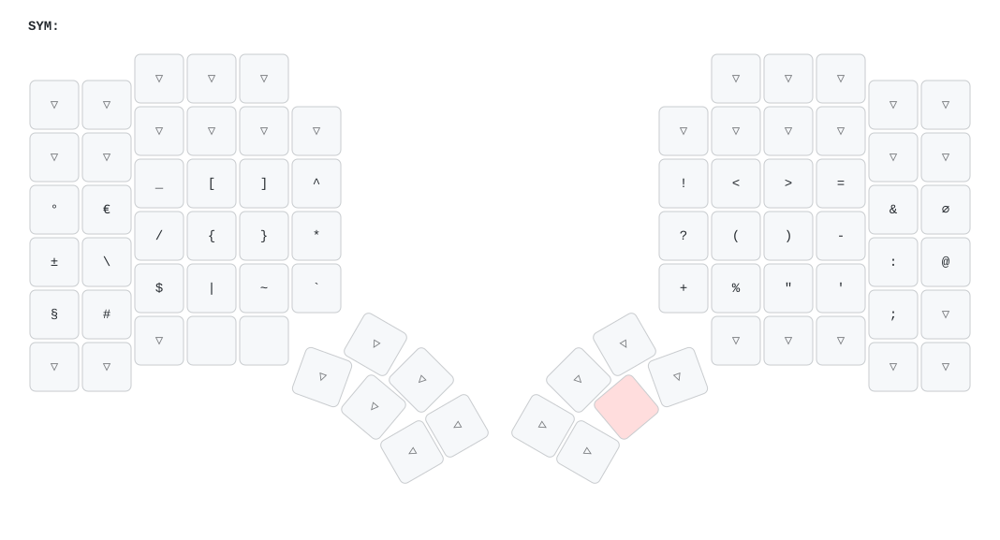

</details>

<details><summary>🧭 Navigation &amp; Numpad (NAV)</summary>

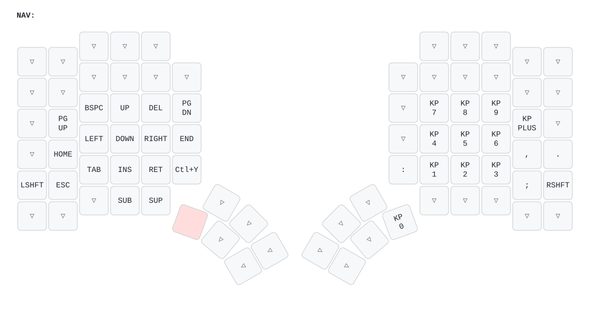

</details>

<details><summary>🪟 Window management (WNDWMGMT)</summary>

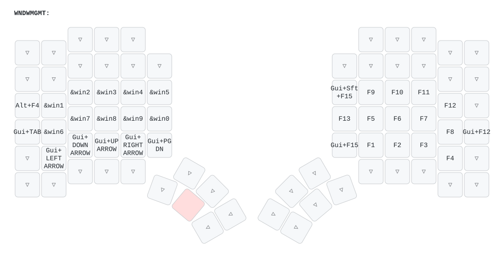

</details>

<details><summary>🇬🇷 Greek letters (GREEK)</summary>

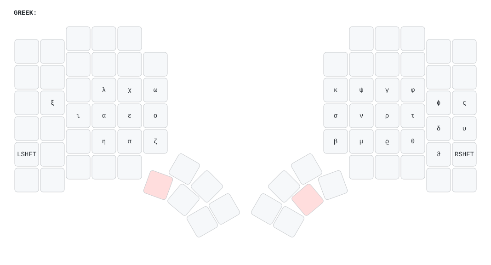

</details>

<details><summary>⁴ Superscript (SUP)</summary>

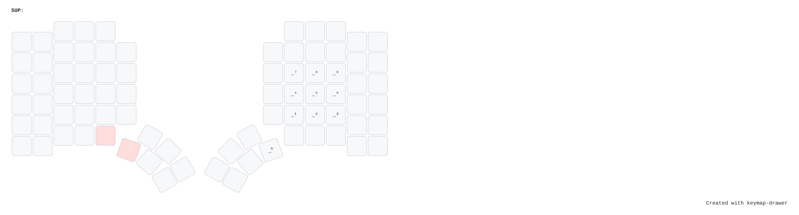

</details>

<details><summary>₄ Subscript (SUB)</summary>


</details>

<details><summary>🗔 FancyZones (FNCYZNS)</summary>

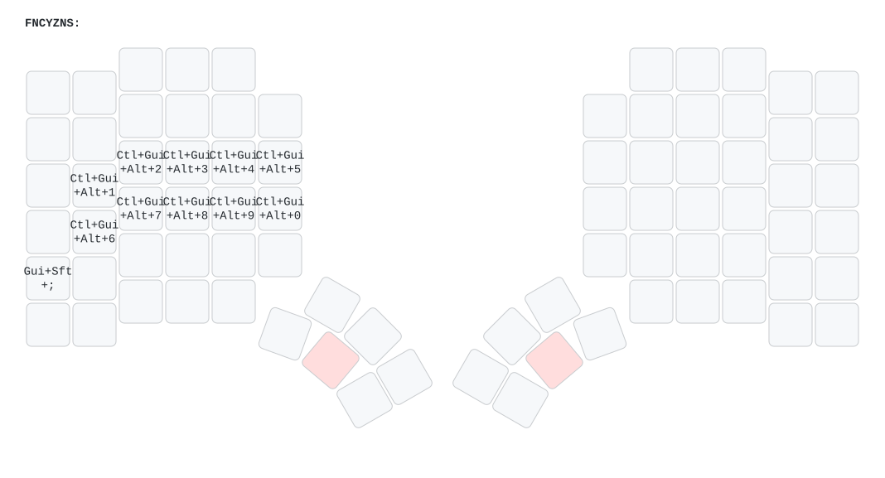

</details>

<details><summary>🖱️ Mouse (MOUSE)</summary>

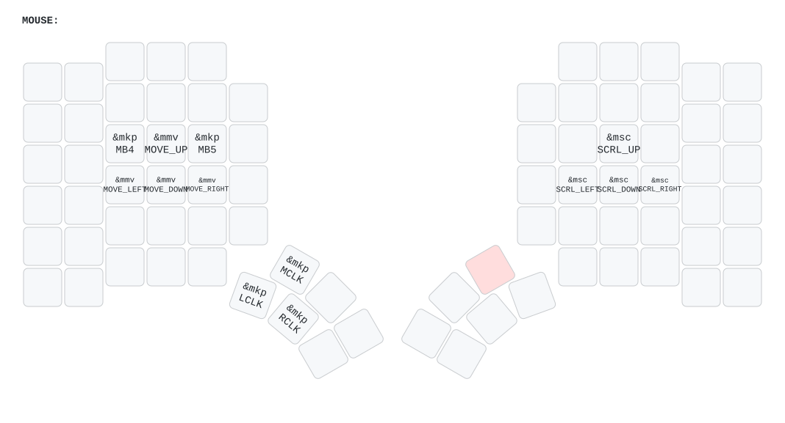

</details>

<details><summary>🎮 Gaming (GAMING)</summary>

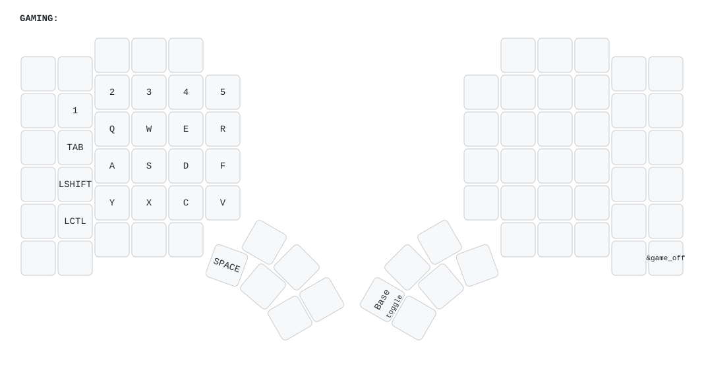

</details>

<details><summary>🪄 Magic</summary>

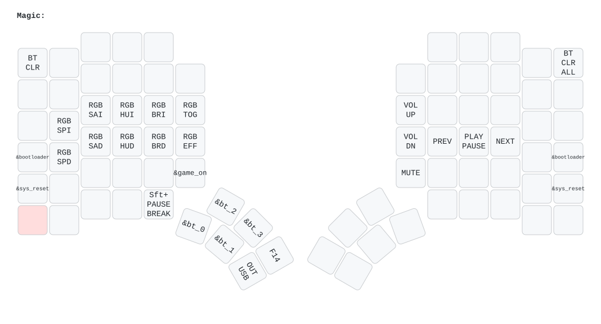

</details>

<details><summary>🗺️ All layers in one image</summary>

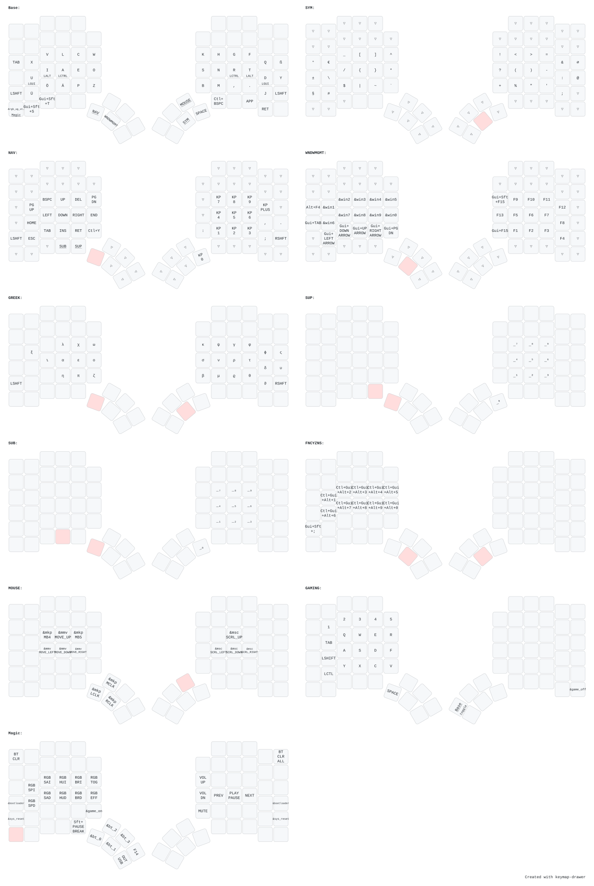

</details>

## Thumbcluser usage
I want to use only two keys from the thumb cluster regularly, the outermost ones on the bottom row. The other ones are too far away for comfortable regular usage. 
### Single key actions

There these 4 actions:
| Combination | Action |
| ----------|----------|
| X _ $~~$ _ _ | Navigation & Numpad   |
| _ X $~~$ _ _ | Window management    |
| _ _ $~~$ X _ | Symbols    |
| _ _ $~~$ _ X | Space bar    |

### Dual key actions
In can go to more layers by holding down two thumb keys at the same time. Requirements are:
* I don't want to overload shift on the right hand --> only Symbol layer key can be used
* The order in which the modifiers are pressed should not matter
* I want to use the conditional layers feature of ZMK to implement this
* The layer keys must be on opposite hands. I only allow on key from the left thumb cluster + one key from the right thumb cluster
* These combinations are quite easy to press and leaves digits 2-5 free for typing. It would be a good idea to use them for layer switching instead of single key presses

These are the remaining Combinations:

| Combination |Primary Layer | Action |
| ----------|----------|----------|
| X _ $~~$ X _ | Navigation & Numpad | Greek letters |
| X _ $~~$ _ X | Navigation & Numpad | *unavailable¹*    |
| _ X $~~$ X _ | Window management | Fancy Zones  |
| _ X $~~$ _ X | Window management | *unavailable¹*  |

greek 
keyboard management

¹ This would include the spacebar <br>

## Unicode symbols
I want to be able to type unicode directly from different layers on the keyboard. Mainly for greek letters, super and subscript, e.g.: λ₀, τ²..... I use WinCompose and urob's [ZMK-UNICODE](https://github.com/urob/zmk-unicode)

<details>
<summary> Details </summary>
  
In the *.keymap file, add:
```
&uc {
  default-mode = <UC_MODE_WIN_COMPOSE>;  // Default to WinCompose input system
  win-compose-key = <F14>;        // Overwrite WinCompose compose key
};
```

In the keymap, put the following code:
```
&uc 0x3BF 0x39F
```
The second code is the one that gets processed when shifted.

</details>


## F-Keys and F-Keys combination usage
<details>
<summary> List of how I assigend function keys and their modifier combitanios </summary>
  
| Combination | Action |
| ----------|----------|
| F13 |  Mousless Overlay  |
| F14 |  WinCompose compose key |
| WIN+F15 |  PowerToys Command Palette  |
| WIN+SHIFT+F15 | PowerToys Window Walker |
| F16 |  unassigned  |
| F17 |  unassigned  |
| F18 |  unassigned  |
| F19 |  unassigned  |
| F20 |  unassigned  |
| F21 |  unassigned  |
| F22 |  unassigned  |
| F23 |  unassigned  |
| F24 |  unassigned  |

</details>
